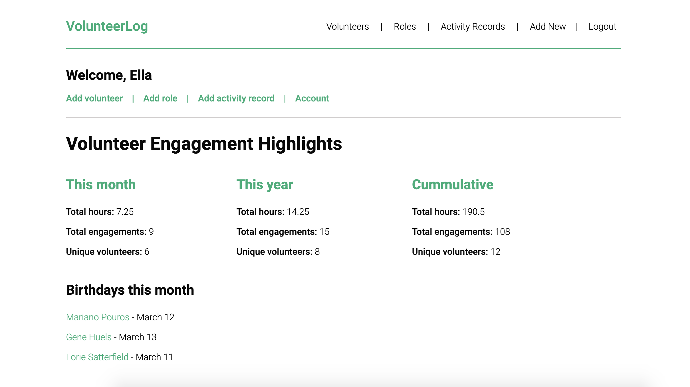
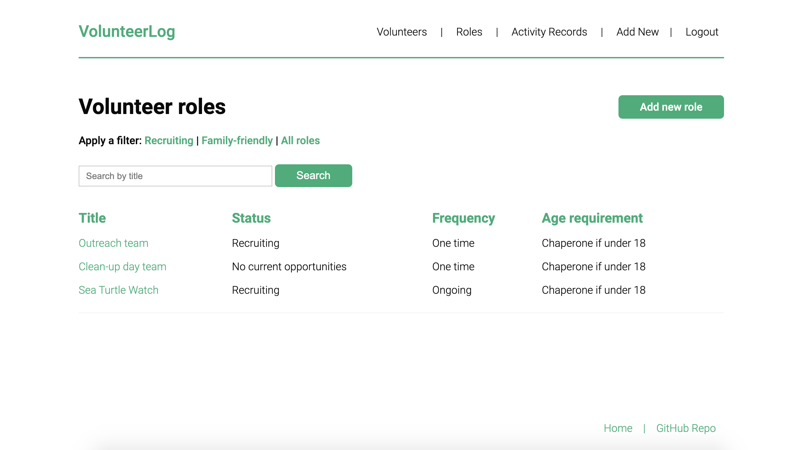
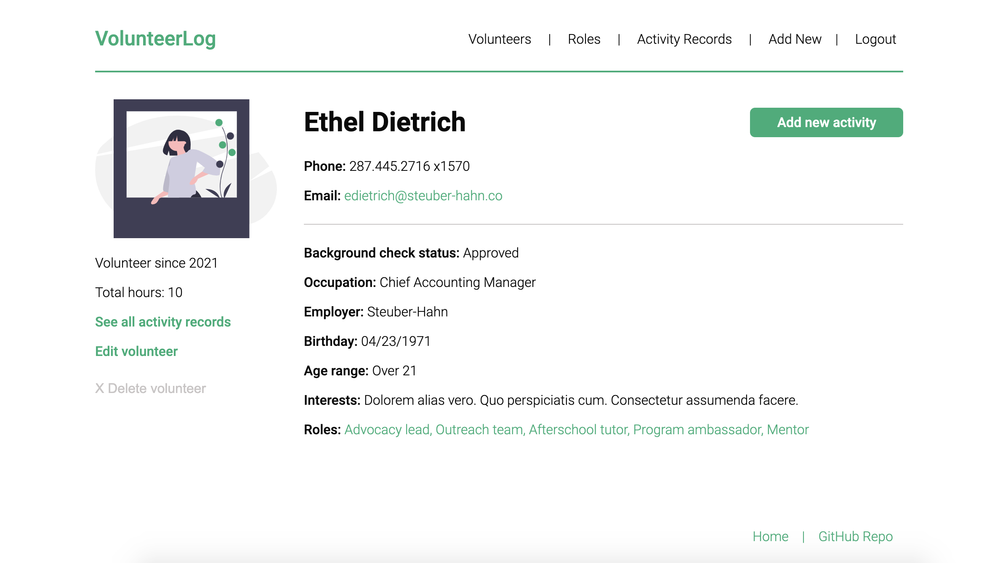

# VolunteerLog

## Description

This Rails-based app helps volunteer-program staff track and report on volunteer engagement in their organization. Users can create records for volunteers, roles, and individual volunteer engagements. 

The main dashboard displays key volunteer stats for the current month and year, as well as running totals. 
 

Search and filter features (e.g., 'family-friendly roles') make it easier to find specific records and opportunities. 
 

Volunteer profiles provide a space for tracking details helpful to volunteer-program staff, like a volunteer's background check status, contact info, birthday, and interests. 
 

## Installation and Usage

Fork and clone this repo to your local machine. In your terminal, make sure you're in the project's main directory then run the command `bundle install` to install dependencies. 

Run the migrations next to set up your database by using the command `rake db:migrate` in your terminal.

To seed your database with example data like that shown in the screenshots, use the command `rake db:seed`.

To view the app on your local host, run the command `rails s` then use your browser to navigate to the port listed (port 3000).

### OmniAuth Setup

This app uses [OmniAuth](https://github.com/omniauth/omniauth-github) to offer sign up/login via GitHub. To utilize that feature, you'll need to sign up for an OAuth2 Application ID and Secret through the [GitHub Applications page](https://github.com/settings/applications).

To try out this app on your local host, set up a new OAuth App using http://localhost:3000 as your homepage URL and http://localhost:3000/auth/github/callback as your authorization callback URL.

Create a `.env` file in the root of this directory and add your ID and Secret as environment variables in the format below:

`GITHUB_KEY=yourIDhere`

`GITHUB_SECRET=yoursecrethere`

## Contributing

Bug reports and pull requests are welcome on GitHub at https://github.com/staceymck/volunteer-log. This project is intended to be a safe, welcoming space for collaboration, and contributors are expected to adhere to the [code of conduct](https://github.com/staceymck/volunteer-log/blob/main/CODE_OF_CONDUCT.md).

## License

The project is available as open source under the terms of the [MIT License](https://opensource.org/licenses/MIT).

## Code of Conduct

Everyone interacting in the VolunteerLog project’s codebases, issue trackers, chat rooms and mailing lists is expected to follow the [code of conduct](https://github.com/staceymck/volunteer-log/blob/main/CODE_OF_CONDUCT.md).
